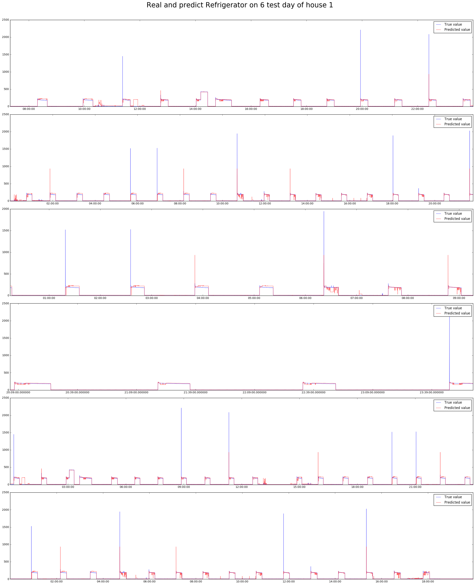

# Energy Disaggregation

Disaggregation allows us to take a whole building (aggregate) energy signal, and separate it into appliance specific data.

This project aim to apply some machine learning techniques (decision tree, deep neural network, long term short term memory) on the energy disaggregation problem.

## Dataset

We use the low-freq (at 1Hz) of [REDD dataset](http://redd.csail.mit.edu/). You can download it [here](http://redd.csail.mit.edu/) with the id/password : redd/disaggregatetheenergy.

Extract the dataset and put it in the same directory with the ipython notebook file

## Requirement

- Python 3
- Pandas
- Scikit-learn
- Tensorflow
- Keras

## License

The content of this repository is licensed under a [MIT license](http://choosealicense.com/licenses/mit/)
